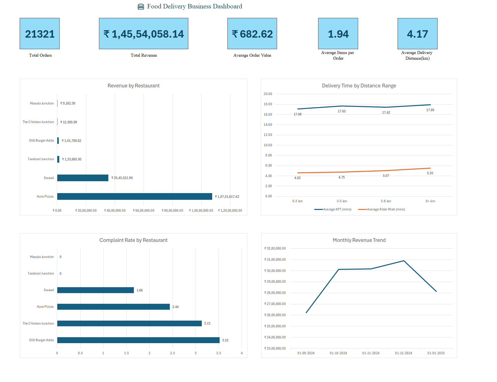

# 🍔 Food Delivery Business Analysis

An end-to-end data analysis project covering the full pipeline — from raw data cleaning in Python, to storage and querying in MySQL, to a fully interactive business dashboard built in Excel.

---

## 📁 Project Structure

```
food-delivery-analysis/
│
├── data/
│   └── food_delivery_cleaned_data.xlsx
│
├── python/
│   ├── data_cleaning.py
│   └── load_to_mysql.py
│
├── sql/
│   └── food_delivery_business_analysis.sql
│
├── visuals/
│   ├── food_delivery_dashboard.xlsx
│   └── dashboard_preview.png
│
└── README.md
```

---

## 🛠️ Tech Stack

- **Python** — data cleaning and preprocessing (pandas)
- **MySQL** — data storage and business analysis queries
- **Microsoft Excel** — dashboard, visualizations, and business insights

---

## 🔄 How to Run This Project

1. **Clean the raw data**
   ```bash
   python python/data_cleaning.py
   ```
   Reads the raw data file, handles missing values, fixes data types (dates, numerics), removes duplicates, and outputs a cleaned dataset.

2. **Load into MySQL**
   ```bash
   python python/load_to_mysql.py
   ```
   Creates the `food_delivery_orders` table and loads the cleaned data into a local MySQL instance (`food_delivery_analysis` database).

3. **Run the business analysis queries**
   Execute `sql/food_delivery_business_analysis.sql` in MySQL Workbench (or any MySQL client). This covers:
   - Overview KPIs (orders, revenue, AOV)
   - Restaurant performance (revenue, ratings, rankings)
   - Delivery & discount analysis
   - Cancellation & complaint analysis
   - Time-based trends (monthly, daily, hourly)

4. **Explore the dashboard**
   Open `visuals/food_delivery_dashboard.xlsx` to view:
   - **Overview** — key business metrics
   - **Restaurant_Performance** — revenue, ratings, and delivery rate by restaurant
   - **Discounts_Summary** — discount impact and delivery performance by distance
   - **Cancellations** — rejection reasons and complaint analysis
   - **Time_Trends** — monthly, weekly, and hourly order patterns
   - **Dashboard** — consolidated KPI cards and charts
   - **Insights** — written business insights and recommendations

---

## 📊 Key Findings

- **Revenue concentration risk:** Aura Pizzas accounts for **73.87%** of total revenue — the business is heavily dependent on a single restaurant partner.
- **Complaint hotspots:** Dilli Burger Adda (3.52%) and The Chicken Junction (3.13%) have the highest complaint rates; the top complaint categories are non-refunded complaints, poor taste/quality, and poor packaging.
- **Discount behavior:** Promo-discounted orders average fewer items (1.79) than non-promo orders (2.10), suggesting promos may be attracting smaller one-off orders rather than driving bigger baskets.
- **Delivery performance holds up with distance:** KPT and rider wait times increase only gradually as delivery distance grows, indicating stable operational performance even on longer-distance, higher-value orders.
- **Untapped breakfast segment:** No orders are placed between 5 AM–10 AM, pointing to a potential growth opportunity in breakfast delivery.
- **Revenue dipped after peaking in Nov-2024**, declining into Jan-2025 — worth further investigation.

Full analysis and recommendations are available in the **Insights** tab of the dashboard.

---

## 📈 Dashboard Preview



---

## 🔮 Possible Next Steps

- Investigate the causes behind the Nov-2024 → Jan-2025 revenue decline
- Explore diversifying restaurant partnerships to reduce reliance on a single top performer
- Pilot a breakfast delivery offering to capture the currently unserved 5 AM–10 AM window
